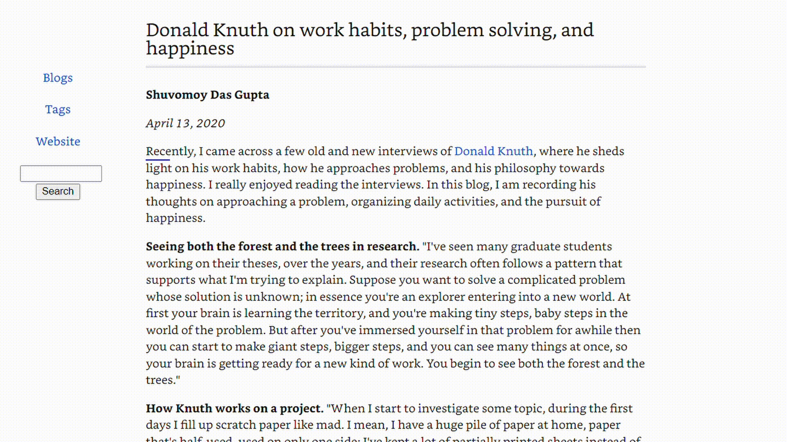

# Read Point
Read Point is a Chrome extension that points to words so you can read better.

Before making Read Point, I would trace with my finger while reading to focus better and read faster, but it was a lot of effort to lift my finger to the screen! That is why I created this solution.

# Installation
Read Point can be installed by downloading the code from this repo and using your browser's dev tools.

It is not currently available in the Chrome Web Store because I did not want to pay a $5 registration fee. It may eventually be available in the Chrome Web Store if I feel like it.

# Benefits
- Guides your eyes to the words
- Use 'wasd' keys to control the pointer

# Possible improvements
The project is young, so expect there to be room for improvement. Here are some ideas I already have in mind.
- Custom speed
- Auto scroll when pointer goes out of screen
